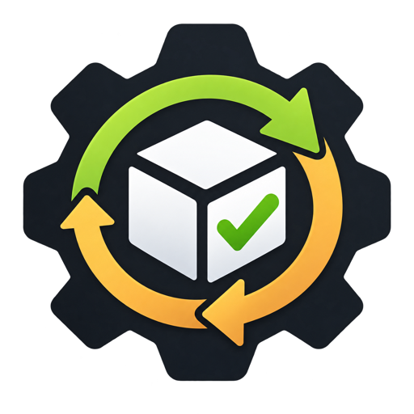

<p align="center">
  
</p>

# GitHub Delivery Operating System

> A GitHub-native Delivery Governance Framework for structured sprint execution, QA review, and collaborative production release control.

[](https://socket.dev/npm/package/github-delivery-os)

Delivery OS embeds structured intake, sprint orchestration, QA governance, and collaborative release gates directly into your GitHub repos — replacing informal coordination (manual approvals, inconsistent sprint tracking, socially enforced releases) without replacing your CI/CD or disrupting how you already work. Install it with [Claude Code](https://claude.com/claude-code), then run it by asking: the **`delivery-ops` skill** turns "create Sprint 14" or "approve release #12" into correctly shaped issues and comments.

## Install with Claude Code

Open Claude Code in the repo you want to set up and paste:

```text
Install GitHub Delivery OS in this repo with the Claude Code skill: run "npx github-delivery-os install --with-templates --with-labels --with-skill --dry-run ." first and show me what it would change. If that looks right, run it without --dry-run, then run "npx github-delivery-os status ." to confirm. Labels need gh auth, so tell me if that's missing.
```

Claude previews the install, writes files only after you confirm, and checks the result. The `delivery-ops` skill lands in `.claude/skills/delivery-ops/`, so you can carry on in the same session.

**Tip: name your approvers in the same prompt.** Claude only sets repo variables when you ask, because they name real people. Add a line like this (GitHub usernames, no `@`; comma-separated for several people; needs repo admin access):

```text
Then set the repo variables RELEASE_APPROVER to alice, QA_APPROVER to bob,carol and QA_ASSIGNEES to bob,carol.
```

With several approvers, a decline from any one of them stands until that same person approves. Skipped this? Set `RELEASE_APPROVER`, `QA_APPROVER` and `QA_ASSIGNEES` afterwards. All three accept comma-separated lists, e.g. `RELEASE_APPROVER=userA,userB`.

<details>
<summary>Or run the command yourself</summary>

```bash
npx github-delivery-os install --with-templates --with-labels --with-skill .
```

From your repo root. `--with-labels` creates labels via the `gh` CLI, `--with-skill` adds the Claude Code skill, `--dry-run` previews first. Drop `--with-skill` if you don't use Claude Code. See the [landing page](https://phaneroo.github.io/github-delivery-operating-system/#install) for every flag combination and when to use it, or [Consumer Setup](docs/consumer-setup.md) for the clone-and-run alternative, configuration, and troubleshooting.

</details>

## Lite install: one person, small projects

Working alone? The lite bundle keeps sprints, tasks, bugs and a release approval, and leaves out the QA machinery you don't need.

```bash
npx github-delivery-os install --bundle lite --with-templates --with-labels --with-skill .
```

| | Lite | Full (default) |
|---|---|---|
| Sprint planning, child tasks, burn-down, auto-close | ✓ | ✓ |
| Task, bug and production release issue forms | ✓ | ✓ |
| Release approval | one approver, you | release approver + QA approver |
| Rolling QA issue, QA Requests, QA assignment, Telegram | none | ✓ |
| Claude Code skill (`--with-skill`) | ✓ (skips QA guidance) | ✓ |

**Shipping a release:** open a Production Release issue. It pings you, and you comment `approved` to authorize it (the issue gets `ready-for-deploy`) or `declined` to hold it back. Approving again lifts a decline. There is no QA approver to set up.

**Setup:** the install sets the `RELEASE_APPROVER` repo variable to your GitHub login (needs `gh`; it never overwrites an existing value and tells you what it did). Skip that with `--no-set-approvers` and set the variable yourself in Settings → Secrets and variables → Actions.

**Switching:** a plain `install --update` keeps a lite repo lite. To fill it out to everything, run `install --bundle full`: it adds the missing workflows and swaps lite's release workflows, release form and labels for the full ones, so QA sign-off applies from then on. Going from full to lite swaps them back, but doesn't remove the QA workflows already installed. `status` shows which bundle a repo is on.

## Delivery Ops: run it by asking Claude

The `delivery-ops` skill (`.claude/skills/delivery-ops/SKILL.md`) lets you drive every workflow in plain language. It checks the repo first, shows the exact issue or comment, and only posts after you confirm.

- **Create issues that trigger real automation:** sprint planning, production release, QA request, and bug issues shaped exactly as the installed workflows expect, not just plain issues
- **Comment as an approver:** release/QA sign-off in the phrasing `authorize-deployment` actually recognizes
- **Check status:** labels, latest comments, sprint burn-down
- **Run autonomous task tracking:** notice tasks/bugs while working in a session, file them, group them into phases via sprints, maintain a roadmap issue, and update/close them as work progresses
- **Turn a spec into a full breakdown:** an SRS/PRD or a plain-language feature description becomes real phase (sprint) and task issues, not just a document
- **Run a cleanup sweep:** finds stale/orphaned/inconsistent issues and roadmap drift, always confirmed before anything is touched

Try: *"Create a sprint called Sprint 14 for checkout revamp, running Oct 1 to Oct 14, with features: …"*, *"Approve release #12"*, or *"How's Sprint 14 doing?"*


What a session looks like (illustrative, on a repo called `acme/storefront`):

```text
You:    Create a sprint called Sprint 14 for the checkout revamp, running
        Oct 1 to Oct 14, with features: guest checkout, saved cards,
        order confirmation email.

Claude: Checked acme/storefront: Delivery OS is installed and the sprint
        and planning labels exist. I'm about to create:

          Title:    SPRINT - Sprint 14
          Labels:   sprint, planning
          Goal:     Checkout revamp
          Dates:    2026-10-01 to 2026-10-14
          Features: guest checkout
                    saved cards
                    order confirmation email

        Create it?

You:    yes

Claude: Created acme/storefront#57. sprint-child-creator has opened
        #58 guest checkout, #59 saved cards and #60 order confirmation
        email. Closing each one moves the sprint's burn-down.

You:    Approve release #61

Claude: You're logged in as jkaweesi22, which matches RELEASE_APPROVER.
        Posting "approved" on #61. authorize-deployment will mark it
        ready to deploy.
```

It also comes with an update check: when a Claude Code session starts in a repo whose install is behind the latest release, Claude offers to update it (only after you confirm). For the same reminder in any terminal when you `cd` into a repo, run `npx github-delivery-os@latest shell-hook --install`. See [Consumer Setup](docs/consumer-setup.md#getting-told-when-an-update-is-out).

Full workflow table, quick start, and Claude Code walkthroughs are on the [landing page](https://phaneroo.github.io/github-delivery-operating-system/).

## What you get

| | |
|---|---|
| **Sprint child creation** | One issue per feature line, automatic burn-down, auto-close at 100% |
| **Dual approval gates** | Release approver + QA sign-off required before deploy; a decline from either side blocks it until that same person approves |
| **Rolling QA reminder** | Every change that reaches `main` is added to one open *"QA REQUEST - Changes awaiting QA"* issue; the QA approver approves or declines it with a comment or a checkbox |
| **Auto-assign QA & Telegram alerts** | QA-labeled issues get assigned automatically; optional alerts for bugs, QA, sprints, releases |
| **Claude Code skill** (`--with-skill`) | Operate it all in plain language — see [Delivery Ops](#delivery-ops-run-it-by-asking-claude) |

### Rolling QA issue

Each direct push to `main` and each PR merged into `main` adds a checklist line to a single open issue, *QA REQUEST - Changes awaiting QA*. Docs-only changes and `[skip qa-request]` commits are left off. A repo never has more than one of these open.

Only the QA approver (`QA_APPROVER`) can decide:
- **Approve:** comment starting with `qa approved`, `approved`, `qa ok`, `looks good`, `lgtm`, `all good`, `good to go`, `ship it` (anything may follow), or just `ok`, `approve`, `tested` or `passed` as the whole comment ("Tested!" counts; "Ok, I'll test tomorrow" doesn't), or with ✅ 👍 ✔️. Or tick the issue's **Approved** box. This closes the issue, and the next change opens a fresh one.
- **Decline:** comment starting with `not approved`, `declined`, `decline`, `rejected`, `reject`, `failed`, `changes needed`, `needs work`, `not ok`, `blocked`, or with ❌ 👎 🚫. The issue stays open, and fixes are added to it.

With several QA approvers, a decline stands until that same person approves. Emoji *reactions* don't count, because GitHub Actions can't see them; put the emoji in a comment. To go back to one QA Request per change, set the repo variable `DELIVERY_OS_AUTO_QA_MODE=per-change`. Details are in [Consumer Setup](docs/consumer-setup.md#rolling-qa-issue-default).

## Documentation

| Document | Description |
|----------|-------------|
| **[Landing page & quick start](https://phaneroo.github.io/github-delivery-operating-system/)** | Overview, full command reference, workflows, Claude Code walkthroughs |
| [PRFAQ](docs/PRFAQ.md) | Product overview and FAQs for all audiences (npm launch, install, governance) |
| [Press release (npm)](docs/press-release.md) | Formal announcement: Delivery OS on npm |
| [Consumer Setup](docs/consumer-setup.md) | Installation, configuration, variables, labels, Telegram, uninstall |
| [How To](docs/how-to.md) | Create sprints, request releases, approve, report bugs, QA requests |
| [Architecture](docs/architecture.md) | Workflows, templates, data flow |
| [Governance](docs/governance.md) | Lifecycle, approval gates, automation rules |

## License

MIT License. See [LICENSE](LICENSE) for details.
