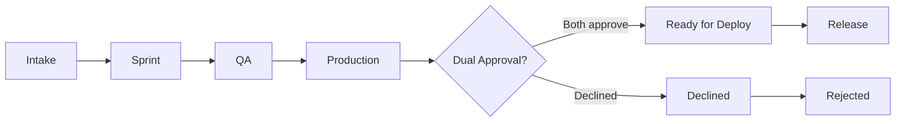

# Governance & Lifecycle

## Philosophy

The Delivery Operating System is built on four principles:

1. **Visibility drives accountability** — Sprint progress and release requests are tracked in GitHub.
2. **Accountability drives quality** — Structured forms and required fields ensure nothing slips through.
3. **Quality protects production** — Approval gates and QA recommendations guard production releases.
4. **Structured delivery reduces risk** — Standardized workflows and labels make delivery predictable.

---

## Lifecycle Stages

| Stage | Labels | Description |
|-------|---------|-------------|
| Intake | `intake` | New item; awaiting triage |
| Bug | `bug`, `qa` | Bug report (template auto-applies) |
| Task | `task` | Structured task |
| Sprint | `sprint`, `planning` | Sprint planning issue |
| Sprint task | `sprint-child` | Child issue (workflow adds; `sprint-active` on issues created before 1.5.0) |
| QA | `qa`, `qa-request` | QA testing requested |
| Production | `production`, `release`, `approval` | Release candidate (template auto-applies) |
| Ready | `ready-for-deploy` | Dual approval received (workflow adds) |
| Declined | `declined` | Release declined (workflow adds) |

---

## Approval Gates

### Production Release

When a production release issue is opened (template auto-applies `production`):

1. **notify-release-approver** pings `RELEASE_APPROVER` with sprint reference and QA recommendation.
2. It also posts a **release roll-up**: one comment titled *What's in this release* that collects the plain-English **What Changed** notes from every QA Request filed since the last authorized release, plus any older one still open (its work hasn't shipped yet, e.g. its PR merged after the previous release). Each one is marked ✅ (dev-reviewed) or ⚠️ (not reviewed, still a draft, or missing), and the **Could affect** areas are merged into one list. QA Requests closed as *not planned* and ones whose PR hasn't merged are left out.
3. Approver reviews and comments.

The roll-up is a **best guess and informational only**: Delivery OS doesn't track exact commit ranges per release, so it goes by when QA Requests were filed, and it never blocks authorization. Refresh it after changes with `gh workflow run notify-release-approver.yml -f release_issue=<N>`; the existing comment is updated in place.

### Dual Approval

**authorize-deployment** listens for comments on production issues:

| Approver | Keywords to approve | Keywords to decline |
|----------|---------------------|---------------------|
| Release (`RELEASE_APPROVER`) | `approved`, `approve`, `ok`, `go ahead` | `declined`, `reject`, `not approved` |
| QA (`QA_APPROVER`) | `qa approved`, `approved`, `qa ok`, `looks good` | — |

Both must approve → `ready-for-deploy` label. Release approver can decline → `declined` label.

Only the release approver's **latest** comment counts as their verdict — a later `approved` comment supersedes an earlier `declined` one (and vice versa), so a release can be re-approved after fixes land without editing or deleting history. Keywords must lead the comment (e.g. `Approved, ship it` matches; `ok, hold off, I have concerns` does not).

---

## Automation Rules

| Event | Workflow | Action |
|-------|----------|--------|
| Sprint issue opened (title "SPRINT -") | sprint-child-creator | Creates child issues with `sprint-child` |
| Child issue closed (body has Parent Sprint) | auto-close-sprint | Updates burn-down; auto-closes at 100% |
| Production release opened | notify-release-approver | Pings RELEASE_APPROVER; posts the release roll-up |
| Comment on production issue | authorize-deployment | Dual approval → ready-for-deploy; closes auto-filed Tasks/QA Requests the release covers (not ones whose PR is still unmerged) |
| QA/qa-request issue opened | auto-assign-qa | Assigns QA_ASSIGNEES |
| Commit pushed to `main`, or PR merged | auto-qa-request | Rolling mode (default): adds a line to the open rolling QA issue, opening one if none — unless only docs/settings changed |
| PR opened or updated, or commit pushed to `main` | auto-qa-request | Per-change mode: files a QA Request (and a backing Task, if none is linked) unless only docs/settings changed |
| QA approver comments or ticks the Approved box on the rolling QA issue | qa-rollup-approval | Approve → ticks every line and closes it; decline → keeps it open (Outcome *Fail*); anyone else → ignored with a reply |
| PR closed without merging | auto-qa-request | Closes the Task/QA Request it auto-filed for that PR (reopening the PR reopens them) |
| Bugs, QA, sprints, releases, PR merged | telegram-issues | Sends alerts (if secrets set) |

---

## Workflow Triggers

| Workflow | Trigger |
|----------|---------|
| sprint-child-creator | `issues.opened` (title contains "SPRINT -") |
| auto-close-sprint | `issues.closed` (body contains "Parent Sprint") |
| notify-release-approver | `issues.opened` (label `production`), `workflow_dispatch` (roll-up refresh) |
| authorize-deployment | `issue_comment.created` (on production issue) |
| auto-assign-qa | `issues.opened` or `labeled` (label `qa` or `qa-request`) |
| auto-qa-request | `pull_request.opened`/`ready_for_review`/`reopened`/`synchronize`/`closed`, `push` to `main` |
| qa-rollup-approval | `issue_comment.created`, `issues.edited` (on the `qa-rollup` issue) |
| telegram-issues | `issues`, `issue_comment`, `pull_request` |
